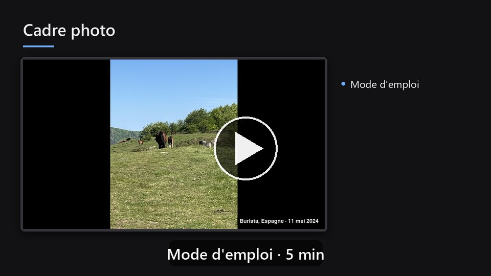
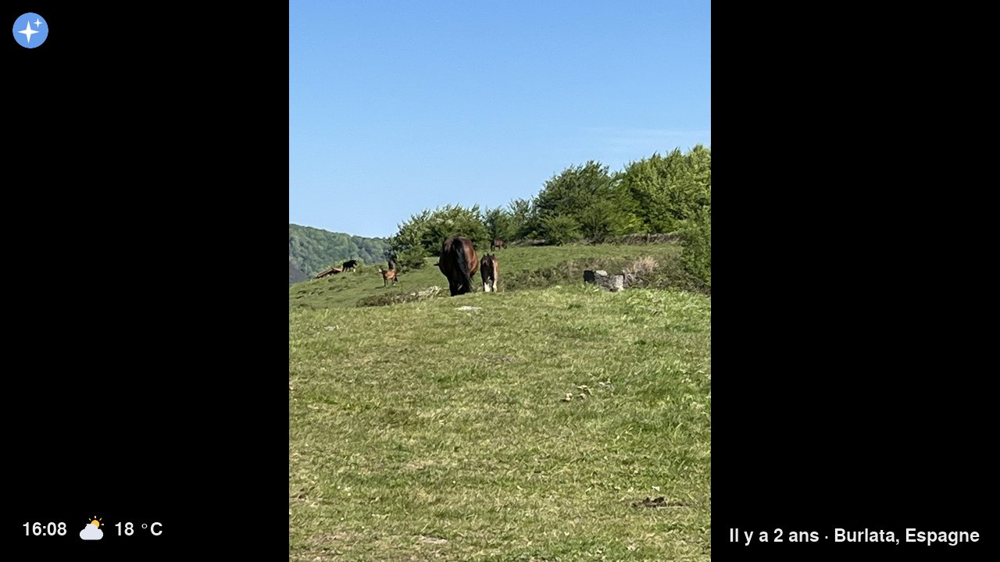
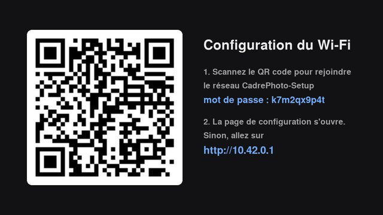
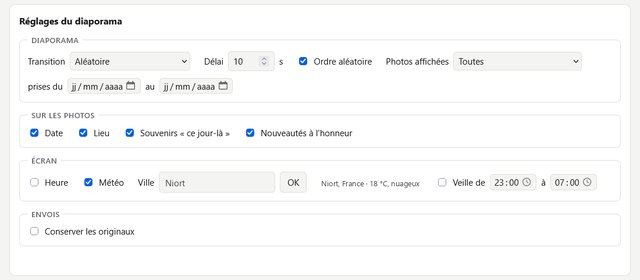
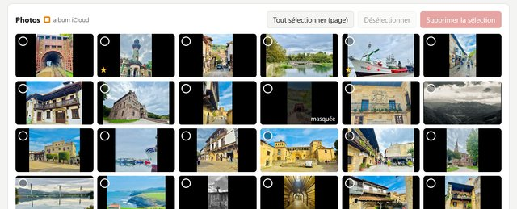

# Cadre photo

**Transformez n'importe quelle télé en cadre photo familial, avec un Raspberry Pi à 20 €.**

Vos photos défilent en plein écran, avec de jolies transitions, la date et le lieu de prise de
vue. La famille ajoute ses photos depuis son téléphone, sans application ni compte, ou les
partage dans un album iCloud que le cadre suit tout seul. Pensé pour être installé chez des
proches et oublié : il se configure au Wi-Fi par un QR code, se pilote avec la télécommande de
la télé, et se met à jour à distance.

[](docs/video/cadre-photo-mode-d-emploi.mp4)

*Mode d'emploi en vidéo, 5 min : [docs/video/cadre-photo-mode-d-emploi.mp4](docs/video/cadre-photo-mode-d-emploi.mp4)*

## Ce qu'il sait faire



- **Diaporama plein écran** : fondu, glissements, volet ; photos verticales et horizontales bien
  cadrées ; date, lieu (« Sallanches, France ») et souvenirs « Il y a 2 ans ».
- **Ajout de photos depuis le téléphone** : on scanne le QR code affiché à l'écran, on choisit
  ses photos, c'est tout. Les photos sont réduites avant l'envoi : rapide, même en Wi-Fi faible.
- **Album iCloud partagé** : collez le lien, le cadre se synchronise toutes les 30 minutes.
- **Installation sans clavier** : sans Wi-Fi connu, le cadre crée son propre réseau et affiche un
  QR code ; on choisit le Wi-Fi de la maison depuis son téléphone.
- **Télécommande de la télé** (HDMI-CEC) : photo suivante, précédente, pause, QR code.
- **Message sur le cadre** (« Bon anniversaire Mamie ! »), en bandeau ou en plein écran.
- **Heure et météo** discrètes, veille programmée la nuit (la télé s'éteint et se rallume).
- **Favoris, photos masquées, choix de ce qui défile** (album, envois, période).
- **Mise à jour à distance** en deux clics, signée par vous, avec retour automatique à la
  version précédente en cas de problème ; rapport de diagnostic à vous envoyer.
- **Respect de la vie privée** : tout reste sur le cadre, aucun compte ni service en ligne
  obligatoire.

| Configuration au Wi-Fi | Message de la famille |
|---|---|
|  |  |

| La page de gestion (téléphone ou ordinateur) | |
|---|---|
|  |  |

## Matériel

| Élément | Remarque |
|---|---|
| Raspberry Pi Zero W (ou Zero 2 W) | le Zero 2 W démarre environ 3 fois plus vite |
| Carte microSD de 16 à 32 Go | classe A1 de préférence |
| Alimentation micro-USB 5 V, 2,5 A | une bonne alimentation évite les plantages |
| Câble ou adaptateur mini-HDMI vers HDMI | le Pi Zero a une prise mini-HDMI |
| Une télé ou un écran HDMI | HDMI-CEC (Anynet+, Simplink…) pour la télécommande et la veille |
| Un PC pour l'installation | Windows (Git Bash), macOS ou Linux |

Budget : environ 30 € hors télé.

## Installation en bref

1. **Préparer la carte** avec [Raspberry Pi Imager](https://www.raspberrypi.com/software/) :
   Raspberry Pi OS Lite (32 bits), nom `cadre`, utilisateur `cadre`, Wi-Fi de la maison, SSH
   avec votre clé publique (elle servira aussi à signer les mises à jour).
2. **Installer le cadre** depuis votre PC :
   ```bash
   git clone https://github.com/54yhbw7nfw-spec/cadre-photo.git
   cd cadre-photo
   ./install.sh cadre@cadre.local     # mot de passe de l'utilisateur demandé une fois
   ssh cadre@cadre.local sudo reboot
   ```
3. **Brancher sur la télé** : au bout d'une minute et demie, un QR code mène à la page de
   gestion. Ajoutez vos photos, c'est parti.

Détails : [documentation technique](docs/technique.md) ·
[mise à jour à distance](docs/mise-a-jour.md) ·
[cahier des charges](docs/cahier-des-charges.md).

## Sous le capot

Python 3 (pygame / SDL2 en KMSDRM pour l'affichage, Flask pour la page de gestion, Pillow pour
les photos), NetworkManager, systemd. Le tout tient dans 512 Mo de RAM sur un processeur
monocœur de 2017, avec des transitions fluides à 60 images/s.

Licence : [CC0](LICENSE) (domaine public).
